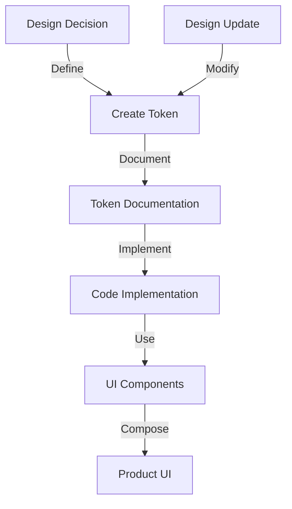

 

# Design Tokens

Design tokens are the foundational elements that ensure consistency, accessibility, and maintainability across our design system. They represent the smallest units of visual design decisions, such as colors, spacing, typography, and other UI elements.

## What Are Design Tokens?

Design tokens are named entities that store visual design attributes. They help us:

- **Maintain consistency** across products and platforms
- **Simplify updates** by centralizing design values
- **Improve accessibility** by enforcing compliant color contrast and spacing
- **Bridge the gap** between design and development

Our token system follows a structured naming convention that describes the token's purpose rather than its visual properties, ensuring design decisions remain consistent regardless of implementation details.

## Token Categories

Our design system includes the following token categories:

| Category | Description | Example Use Cases |
|----------|-------------|-------------------|
| [Colors](/app/tokens/colors) | Brand colors, semantic colors, UI element colors | Text, backgrounds, borders, status indicators |
| [Typography](/app/tokens/typography) | Font families, sizes, weights, line heights | Headings, body text, captions, code blocks |
| [Spacing](/app/tokens/space) | Margins, paddings, gaps | Component spacing, layout grids, component composition |

## Using Tokens in Figma

### Accessing Tokens

1. **Open the Assets Panel**: Click on the assets icon in the left sidebar or press <kbd>Alt</kbd>+<kbd>2</kbd> (<kbd>Option</kbd>+<kbd>2</kbd> on Mac)
2. **Navigate to Styles**: In the assets panel, find the "Styles" section
3. **Browse Categories**: Our tokens are organized by category (Color, Text, Effect, Grid)

### Applying Tokens in Figma

#### Colors
1. Select an element
2. In the right sidebar, click on the color property you want to change
3. Choose from the available color tokens in the dropdown menu

#### Typography
1. Select a text element
2. In the right sidebar, click on the text style property
3. Choose from the available text tokens in the dropdown menu

#### Spacing
1. When creating layouts, use our spacing tokens for consistent margins and paddings
2. Use auto layout and apply spacing tokens to the gap property

### Creating Components with Tokens

When creating components in Figma:

1. Always use design tokens for visual properties
2. Avoid hard-coded values
3. Apply tokens to component variants
4. Document the tokens used in component descriptions

## Implementation Guidelines

### For Developers

- Use the token names as defined in the design system
- Implement tokens through the Tailwind CSS utility classes
- Reference design tokens directly rather than hard-coding values
- For responsive designs, maintain token relationships across breakpoints

### For Designers

- Always use tokens instead of custom values
- When creating new designs, check the existing token system first
- If you need a new value, propose a token addition rather than using one-off values
- Test designs across different themes and color modes to ensure proper token usage

## Best Practices

1. **Use semantic tokens**: Choose tokens based on their purpose (e.g., `primary` instead of `blue`)
2. **Maintain accessibility**: Ensure proper contrast ratios when using color tokens
3. **Consider dark mode**: Test designs with both light and dark mode tokens
4. **Consistent spacing**: Apply spacing tokens consistently for predictable layouts
5. **Document exceptions**: If you need to deviate from the token system, document the reason

## Token Workflow

## Contribution Guidelines

To propose changes to our token system:

1. Review the existing tokens to avoid duplication
2. Provide a clear rationale for new tokens
3. Consider the impact on existing components
4. Submit a proposal following our contribution template
5. Include examples showing the token in use

By following these guidelines and leveraging our design tokens effectively, we can create consistent, maintainable, and accessible user interfaces across all our products.